# Empty XR Project
This is a ready go to Unity project for XR developement. It has all the configuration needed with Meta XR SDK. 

You can import this project directly into Unity and start developement (no need to follow step 3).

## 1. Tutorials
Tutorials are available [here](doc/tutorials/index.md).

## 2. How to install Unity and open this project
1. Download this repository from GitHub. (Code > Download ZIP) 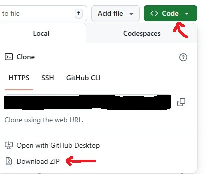
2. Unzip the repository.
3. Download & install Unity Hub from [Unity's website](https://unity.com/download).
4. Open Unity Hub
5. click "Add project from disk". 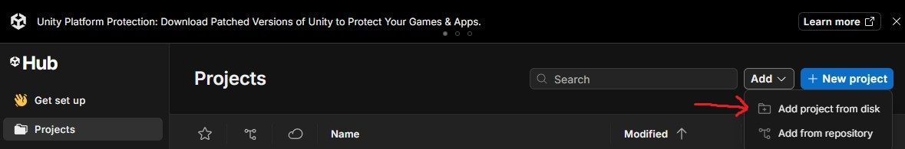
4. Select the downloaded (and unzipped) folder.
5. The project should appear in the projects list.  
7. Click to open the project!
    - If the version of Unity Editor used by the project is missing from your computer you will be prompted to install Unity Editor. Select the Unity Editor under the "MISSING VERSION" section. Note: You can choose another Unity Editor version if you like but things may or may not be broken. 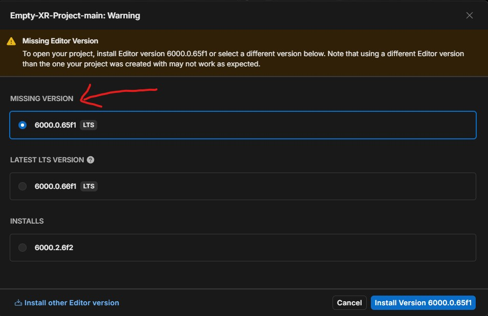
    - On the next screen, select "Microsoft Visual Stuio Community 2022" and "Android Build Support" 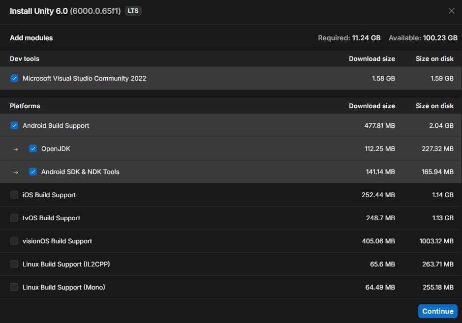
    - Continue and wait for Unity Editor to install and try opening the project again.
8. Wait for the project to load. It might take a moment depending on your Internet connection. You may be asked to restart the editor during the process. 
9. You are all set!

## 3. Install Meta Horizon Link (PCVR)
If you plan to develop using PCVR, you will need the Meta Horizon Link application on your computer. PCVR does require a suitable setup with a GPU.
1. Download & install Meta Horizon Link from [Meta's website](https://www.meta.com/help/quest/1517439565442928/?srsltid=AfmBOopr6p8ztxW4W2LhbqsWAmom2pzWmhQkLw-YkJ5o-hMEviTbtnzM).
2. Open Meta Horizon Link.
3. In the Settings, click on the General tab and make sure Meta Horizon Link is set as the active OpenXR Runtime. 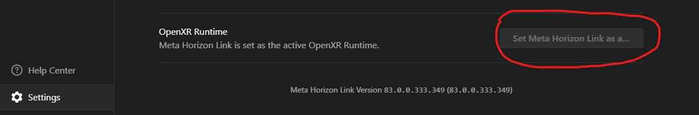
4. Go to the Developer tab and make sure the required settings are turned on. 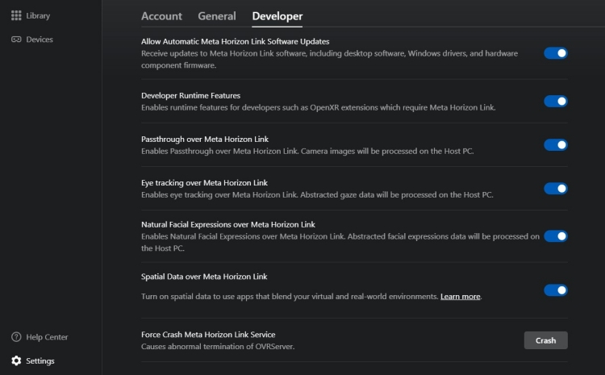

## 4. How to recreate this project from scratch (for information purposes)
The screenshots shown here may look different depending on your Unity Version. The steps should remain similar. 
1. In Unity Hub's Projects tab, click on "New Project button"  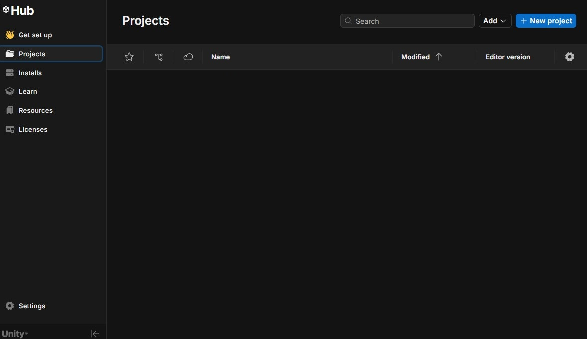
2. Setup your project:
    - Select the editor version.
    - Select "Universal 3D" template
    - Choose your project name (can be changed later)
    - Choose a folder location for your project.  
    - Dot not check "Use Unity Version Control" (it is recommended to use GitHub instead) 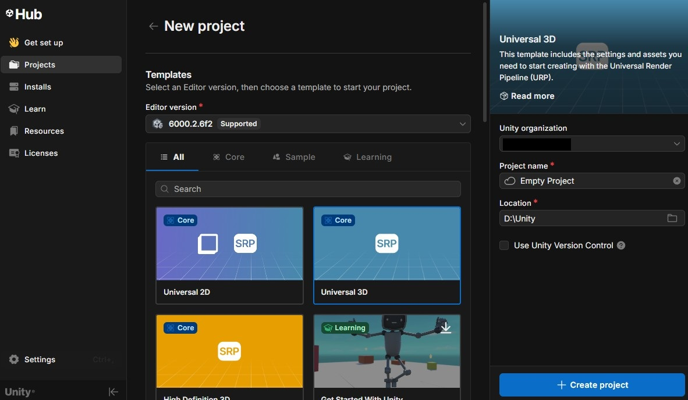

3. Click on "Create project" button.
4. Your project should now appear in the project list in Unity Hub. Click it to open it (this may take a moment the first time.)  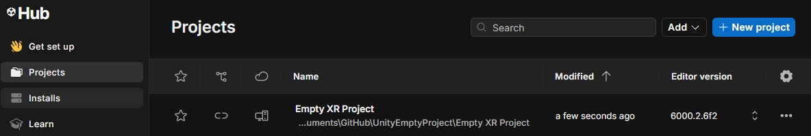
5. After the project opens, Go to Window > Package Management > Package Manager  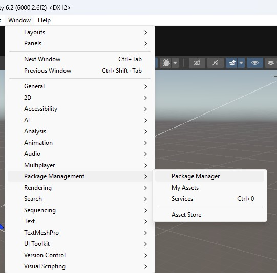
6. In the panel that opens, click the "+" sign and select "Install package by name" 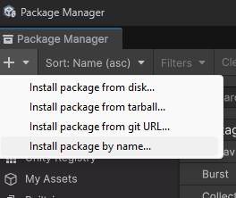
7. Enter "com.meta.xr.sdk.all" for the package name. Optionally, you can specify which version of the package you want. By default, the latest one will be installed. 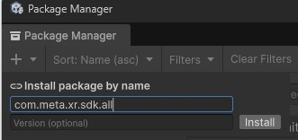
8. Click on "Install"
9. Wait for the install to finish. (This might take a moment)  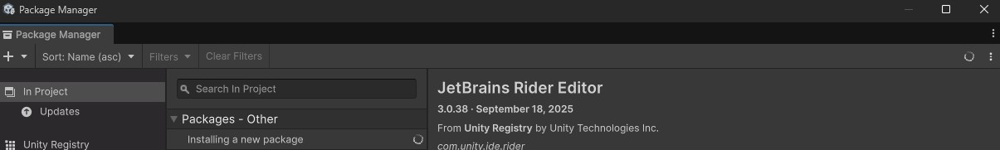
10. When prompted, click on "Restart Editor" 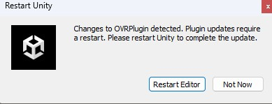
11. Back in Unity Editor, go to Edit > Project Settings 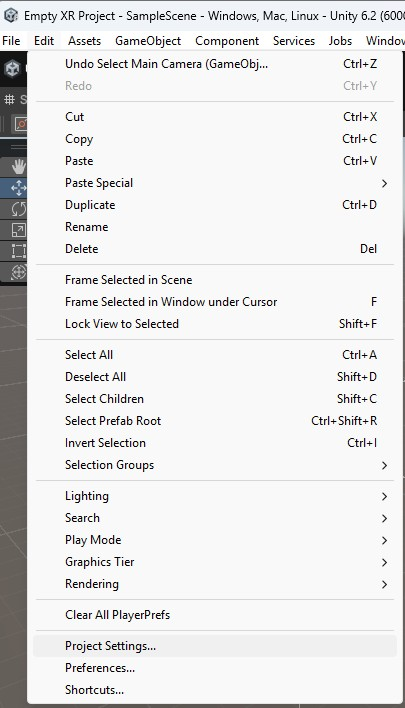
12. In the Window that opens, go to "XR Plugin Management" and click "Install XR Plugin Management"  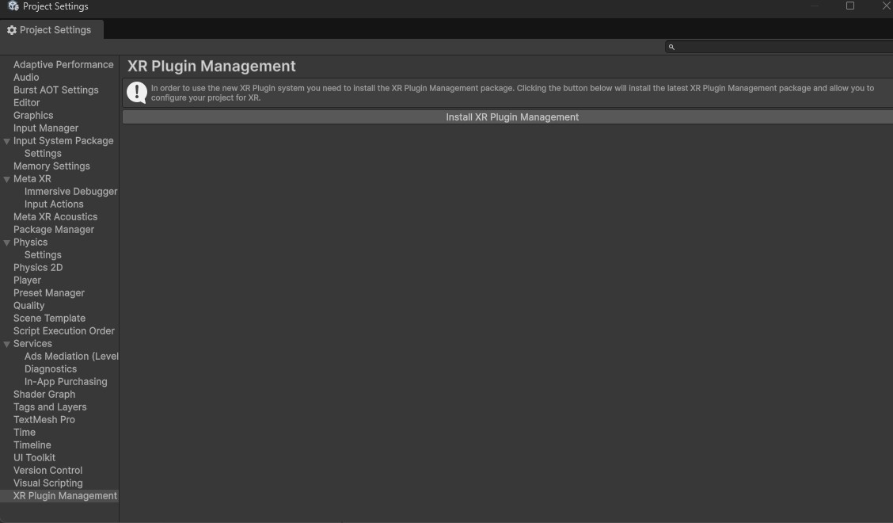
13. Check OpenXR  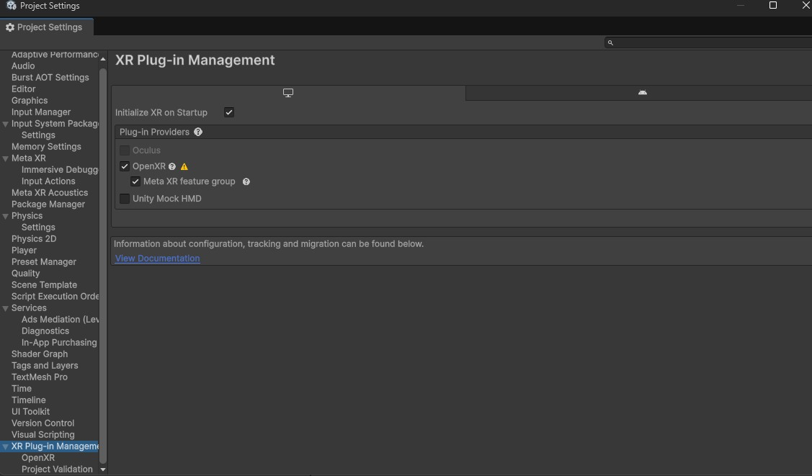
14. When prompted click on "Yes" to enable Meta Quest Features. 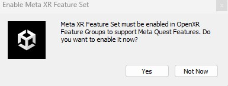
15. Do the same thing for the Android configuration.  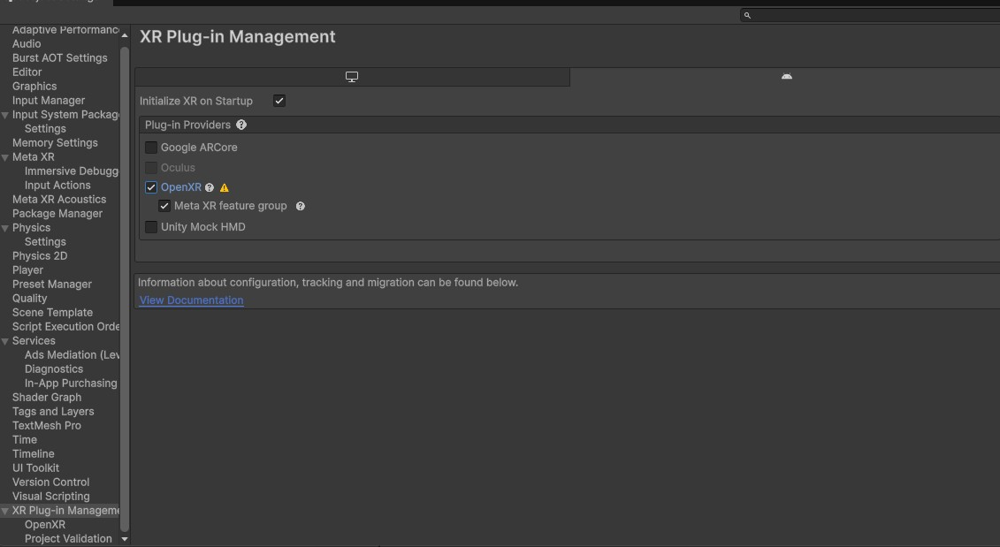
16. Next go to the "Meta XR" tab and click "Fix All" button to fix all the issues until the build is green. Do the same thing for the android build.  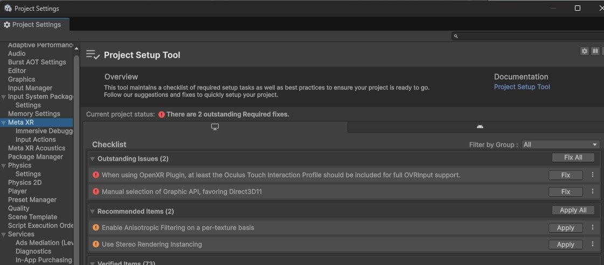
17. Your project is now ready to build for XR! Back in the editor, you can delete the "Main Camera" from the scene, click on "Meta XR Tools" > "Building Blocks" to add the camera rig and get your project started. 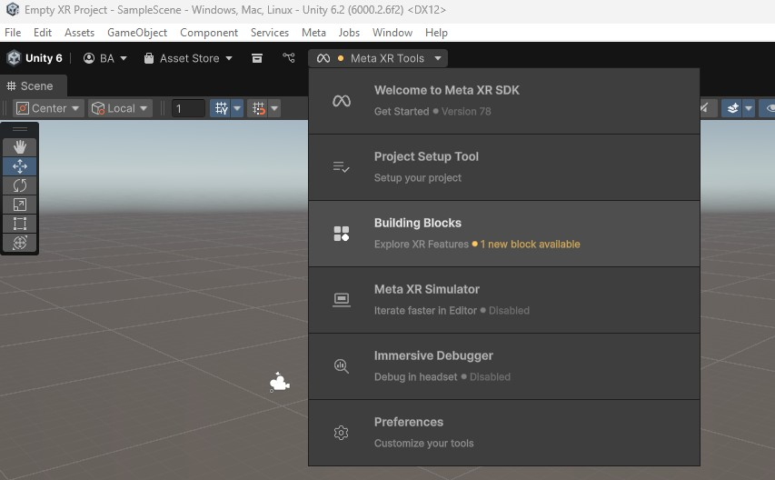
