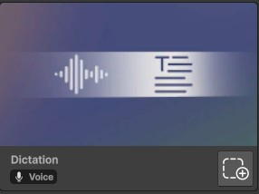
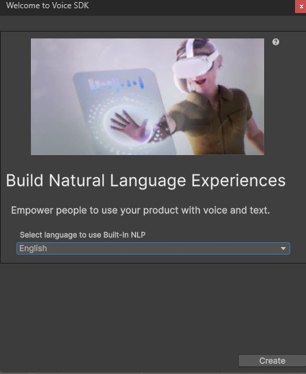
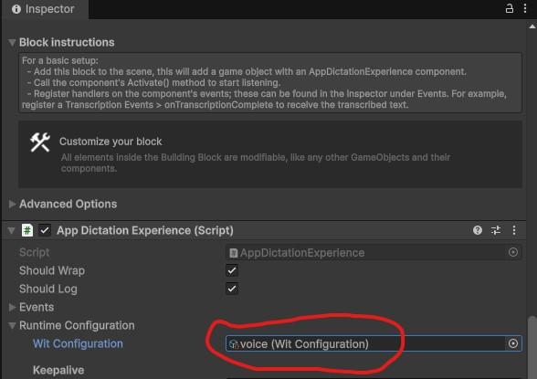

# Voice Recognition
## Description
Speech to text (also known as dictation) is a feature in Meta's Voice SDK that lets you convert the user's speech into text. 

This is an alternative from the Speech to Text building block that should not require an API key (and is therefore free to use).

## Example use cases
1. Voice driven UI navigation (Open inventory, show me the map, etc.).
2. Voice driven interaction with an AI assistant. 

## Tutorial
1. Add the "Dictation" building block to your scene.<br>
2. If the "Welcome to Voice SDK" window pops up...
    - Select "English" as the language to use.
    - Click on "Create" button.
    - Save voice configuration in your asset.
    <br>
3. A new game object "[BuildingBlock] Dictation" should be added to your scene.
4. Select the "[BuildingBlock] Dictation" game object.
5. In the inspector window, expand the "Runtime Configuration" section and make sure the "Configuration" field contains the voice configuration file you created.<br>
6. Add a new game object to the scene.
7. Attach a new script (STTScript) to that game object.
8. Copy paste the following content to the script:
```csharp
using UnityEngine;
using Oculus.Voice.Dictation;
using Meta.WitAi.Dictation.Data;

public class STTScript : MonoBehaviour
{
    private AppDictationExperience dictation;

    void Start()
    {
        dictation = FindFirstObjectByType<AppDictationExperience>();

        if(dictation == null)
        {
            Debug.LogError("AppDictationExperience component not found in the scene.");
            return;
        }

        dictation.DictationEvents.OnPartialTranscription.AddListener(OnPartialTranscription);
        dictation.DictationEvents.OnFullTranscription.AddListener(OnDictationResult);
        dictation.DictationEvents.OnDictationSessionStarted.AddListener(OnSessionStarted);
        dictation.DictationEvents.OnDictationSessionStopped.AddListener(OnSessionStopped);
        dictation.DictationEvents.OnError.AddListener(OnDictationError);

        dictation.Activate();
    }

    void OnDestroy()
    {
        if (dictation != null)
        {
            dictation.Deactivate();

            dictation.DictationEvents.OnPartialTranscription.RemoveListener(OnPartialTranscription);
            dictation.DictationEvents.OnFullTranscription.RemoveListener(OnDictationResult);
            dictation.DictationEvents.OnDictationSessionStarted.RemoveListener(OnSessionStarted);
            dictation.DictationEvents.OnDictationSessionStopped.RemoveListener(OnSessionStopped);
            dictation.DictationEvents.OnError.RemoveListener(OnDictationError);
        }
    }

    private void OnPartialTranscription(string text)
    {
        Debug.Log("Partial result: " + text);
    }

    private void OnDictationResult(string text)
    {
        Debug.Log("Final result: " + text);
    }

    private void OnSessionStarted(DictationSession session)
    {
        Debug.Log("Dictation started");
    }

    private void OnSessionStopped(DictationSession session)
    {
        Debug.Log("Dictation stopped");
    }

    private void OnDictationError(string errorType, string errorMessage)
    {
        Debug.LogError($"Dictation Error: {errorType} - {errorMessage}");
    }
}
```
9. Go back to Unity Editor and wait for the script to compile.
10. When playing your scene, the App dictation experience should start listening (because we used dictation.Activate(); in the Start() function). You should see in the log what you said. You will most likely just need the OnDictationResult event handler as it contains the final text. 
