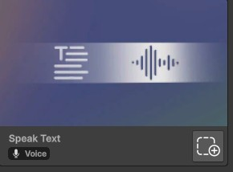
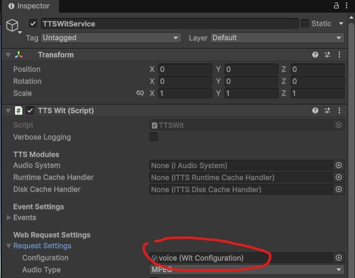
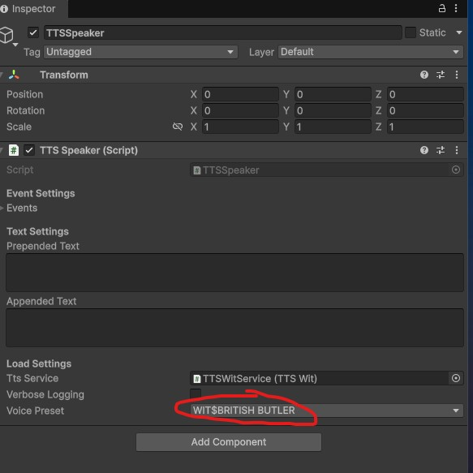

# Text to speech (TTS)

## Description
The text to speech (TTS) feature from the Meta Voice SDK allows you play out loud a predefined text in a specific voice.

This is an alternative from the Text to Speech building block that should not require an API key (and is therefore free to use).

## Example use cases
- Easily create and edit your a narrator's voice without having to record the audios.
- Audio description for the visually impaired.
- Read out loud AI generated content.

## Tutorial
1. Add the "Speak Text" building block to your scene.<br>
2. If the "Welcome to Voice SDK" window pops up...
    - Select "English" as the language to use.
    - Click on "Create" button.
    - Save voice configuration in your asset.
    <br>
3. A new game object "[BuildingBlock] Speak Text" should be added to your scene.
4. Expand the "[BuildingBlock] Speak Text" object.
5. Select the TTSWitService game object.
6. In the inspector window, expand the "Request Settings" section and make sure the "Configuration" field contains the voice configuration file you created. <br>
7. Click on the TTSSpeaker game object in your scene. 
8. In the inspector window, you can change the preset voice to be used by changing the selected option at "Voice Preset". Warning: Some voices are known to not work.<br>
9. Create a new empty game object in your scene. 
10. Add a new empty script to that game object.
11. Add the following content to your script. 2 seconds after playing your scene, the text will be read out loud!
```csharp
using UnityEngine;
using System.Collections;
using Meta.WitAi.TTS.Utilities;

public class SpeakerScript : MonoBehaviour
{
    public TTSSpeaker speaker;

    void Start()
    {
        StartCoroutine(SpeakTest());
    }

    IEnumerator SpeakTest()
    {
        yield return new WaitForSeconds(2f);
        speaker.Speak("Hello, this is a test of the text to speech system.");
    }
}
```
12. Go back to the editor and wait for the script to compile.
13. Drag and drop TTSSpeaker game object to your script's speaker property.
14. Play your scene.
15. You should hear the audio playing after 2 seconds.