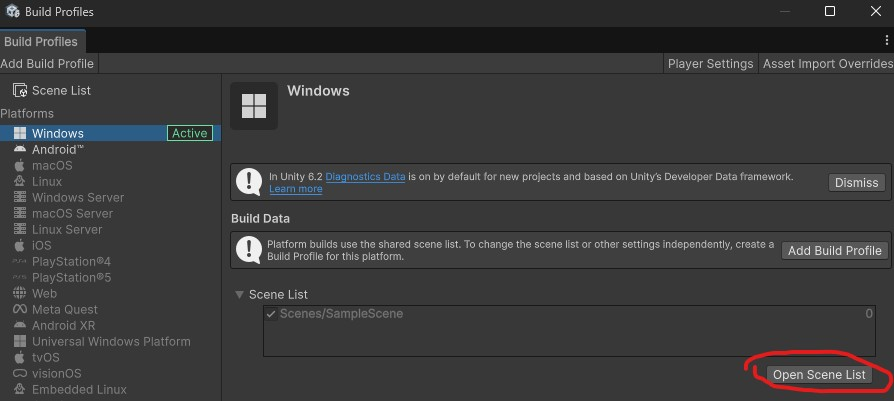
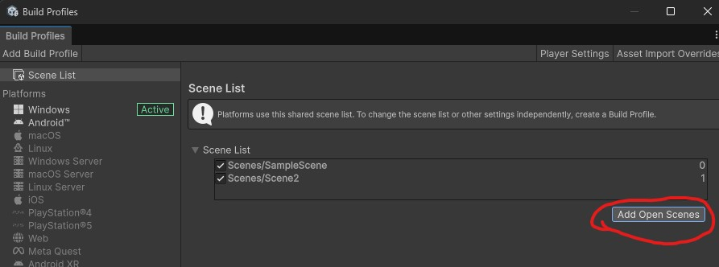

# Changing Scenes
## Description
This tutorial will show you how to switch from one scene to another in Unity.

## Example use cases
- Proceed to the next scene in your storyline.

## Tutorial
1. Create 2 distincts scenes in your assets.
2. In the top menu, go to File > Build Profiles (Keyboard shortcut: CTRL + SHIFT + B)
3. In your platform configuration click on "Open Scene List".<br>
4. In the editor, make sure you open the scene that you want to add to the scene list.
5. Click on "Add Open Scene" button to add the currently opened scene. <br>
6. Do the same for other scenes you want to add.
7. Each scene in your scene list is labeled with an index from 0 to (n - 1), where n is the number of scene in your scene list. 
8. You can close the Build Profiles window.
9. In the editor, open scene 0.
10. Create a new empty game object in the scene.
11. Add a new empty script SceneChange to the game object.
12. Add the following content to the script:
```csharp
using System.Collections;
using UnityEngine;
using UnityEngine.SceneManagement;

public class SceneChange : MonoBehaviour
{
    void Start()
    {
        StartCoroutine(ChangeScene());
    }
    
    IEnumerator ChangeScene()
    {
        yield return new WaitForSeconds(3);

        Scene currentScene = SceneManager.GetActiveScene();
        int nextSceneIndex = (currentScene.buildIndex + 1) % SceneManager.sceneCountInBuildSettings;
        
        AsyncOperation operation = SceneManager.LoadSceneAsync(nextSceneIndex);
        operation.allowSceneActivation = false;

        while(operation.progress < 0.9f)
        {
            yield return null;
        }

        operation.allowSceneActivation = true;
    }
}
```
- This script will wait for 3 seconds and then change to the next scene index (from your scene list in Build Profiles). 
- The "LoadSceneAsync" function makes sure the next scene is ready before switching scenes. This is essential for a smooth transition.  
- If we are at the last scene, the next scene to be loaded will be scene 0. 

13. Go back to the editor and wait for the script to compile.
14. Play your first scene (scene index 0).
15. You should see the change of scenes after 3 seconds.