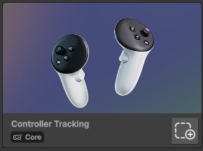

# Controller Buttons Mapping
## Description
This tutorial will show you how to identify the controller button the user has pressed.

## Example use cases
- Execute custom actions for your project.

## Tutorial
This tutorial has been tested with a Meta Quest 3 controllers.

1. Add the "Controller Tracking" building block to your scene.<br>
2. Add new a empty game object to your scene.
3. Add a new script "TestButtonMapping" script to that component.
4. Add the following content for the script:
```csharp
using UnityEngine;

public class TestButtonMapping : MonoBehaviour
{
    void Update()
    {
        // Left Controller Buttons
        if (OVRInput.GetDown(OVRInput.RawButton.LHandTrigger))
            Debug.Log("Left Grip");
        
        if (OVRInput.GetDown(OVRInput.RawButton.X))
            Debug.Log("Left X");
        
        if (OVRInput.GetDown(OVRInput.RawButton.Y))
            Debug.Log("Left Y");
        
        if (OVRInput.GetDown(OVRInput.RawButton.LThumbstick))
            Debug.Log("Left Stick Press");
        
        if (OVRInput.GetDown(OVRInput.RawButton.LIndexTrigger))
            Debug.Log("Left Index Trigger");

        if (OVRInput.GetDown(OVRInput.RawButton.Start))
            Debug.Log("Menu button");
        
        // Right Controller Buttons
        if (OVRInput.GetDown(OVRInput.RawButton.RHandTrigger))
            Debug.Log("Right Grip");
        
        if (OVRInput.GetDown(OVRInput.RawButton.A))
            Debug.Log("Right A");
        
        if (OVRInput.GetDown(OVRInput.RawButton.B))
            Debug.Log("Right B");
        
        if (OVRInput.GetDown(OVRInput.RawButton.RThumbstick))
            Debug.Log("Right Stick Press");
        
        if (OVRInput.GetDown(OVRInput.RawButton.RIndexTrigger))
            Debug.Log("Right Index Trigger");
    }
}
```
5. Go back to the editor and wait for the script to compile.
6. Play your scene.
7. You should see a log everytime you press a controller button.