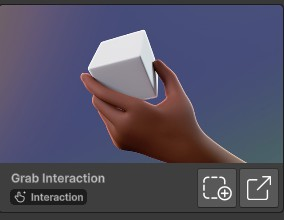
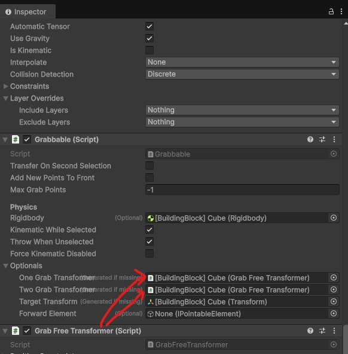
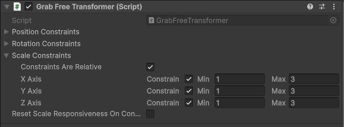
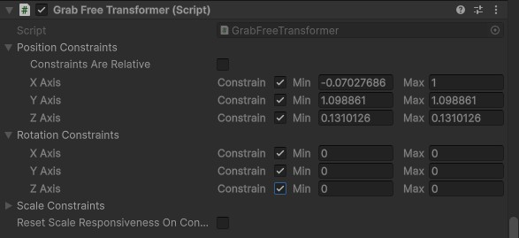
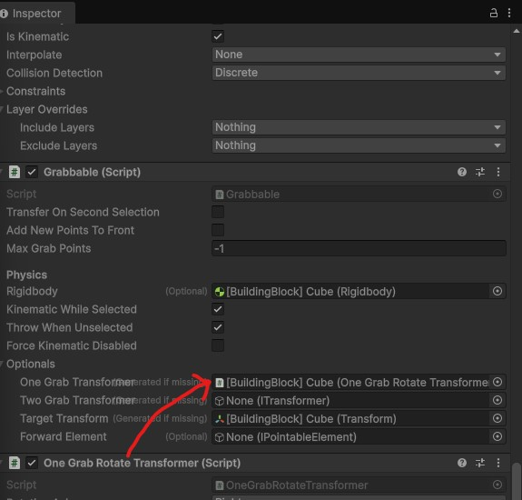
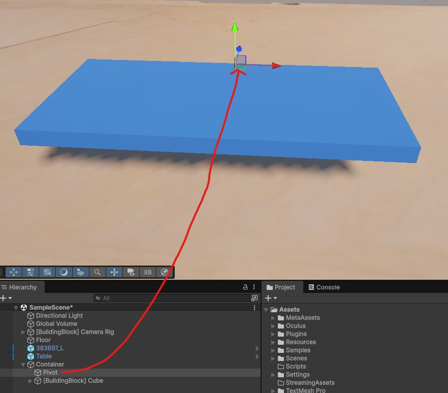
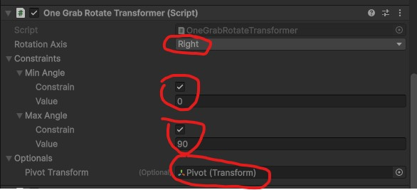

# Grab Interaction
## Description
Grab interactions in the Meta SDK gives your hands a natural, physics‑aware way to pick up, hold, and manipulate objects in XR. They’re one of the core building blocks of hand‑presence and object interactions.

## Example use cases
- Add better visualisation to an object by allowing the user to to scale it.
- Moving a chess piece on a board using a translate motion.
- Opening a chest box by rotating the door.

## Tutorial - 2 hands grab to scale object
1. Add the "Grab Interaction" building blocks to your scene. 
2. A new game object "[BuildingBlock] Cube" should be added to your scene. Select it.
3. In the inspector window, add the script "Grab Free Transformer"
4. Drag and drop the "Grab Free Transformer" script to the Grabbable script's "One Grab Transforme" and "Two Grab Transformer" parameters 
5. In the "Grab Free Transformer" script, change the scale constraints as you desire. In this example, the object can be scaled up to 3 times its orignal size.
    - If "Constraints" is unchecked for any of the axis, there is no limit on the scaling. 
6. Play your scene and use both of your hands to scale the grabbabble object!

## Tutorial - Translate object on an axis
1. Follow the the previous tutorial for setup
2. In the "Grab Free Transformer" script, set the a constraints on the positions. In this case, I have limited the x position to the value shown. The Y and Z axis positions are the same (so cannot be moved on those axis). Also, you may want to restrict rotations on all axis to have a smooth translation. 

## Tutorial - Rotate object on an axis
1. Follow the the previous tutorial for setup
2. Add a "One Grab Rotate Transformer" script to the "[BuildingBlock] Cube" object.
3. Link the "One Grab Rotate Transformer" script to the Grabbable script's "One Grab Transformer" parameter (you can keep or delete the "Grab Free Transformer" script from the "Two Grab Transformer" parameter, if needed). 
4. In your scene create a new empty game object "Pivot" and place it on the pivot point of the your grabbable object. The rotation will occur at that pivot point. (Tip: When moving the pivot game object, you can use 'v' on the keyboard to snap it to a position along the grababble object). 
5. In the "One Grab Rotate Transformer" script:
    - Set the Rotation axis
    - Set the min / max angle
    - Drag and drop the Pivot game object to the "Pivot Transform" parameter. 
6. If you placed the Pivot game object correctly and have the correct angles, you should be able to pivot the object as desired. 

