# Hand Pose Recognition
## Description
The hand pose recognition system in the Meta SDK brings another level of interaction to your XR experience. It can recognize a hand gesture from the user using hand tracking. It can be used as a form of communication to trigger an event in your application. 

## Example use cases
- Recognize a "thumbs up" hand pose from the user to approve a certain action.
- Recognize a "stop" hand pose from the user to pause an animation.

## Tutorial
The simplest way to setup pose detection is to use the game objects from the Meta Interaction SDK's sample scene. We will tweak the objects to make it work in your scene. The hand poses detected included in the sample scenes are thumbs up, thumbs down, rock pose, paper pose, scissors pose and stop hand pose.

1. Add the "Interaction" building blocks to your scene. 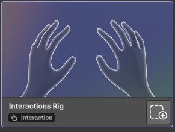
1. In the Unity Editor, open "Package Manager". (Window > Package Manager)
2. In the package manager window, select "Meta XR Interaction SDK"
3. Select the "Samples" tab.
4. Import the sample scenes. 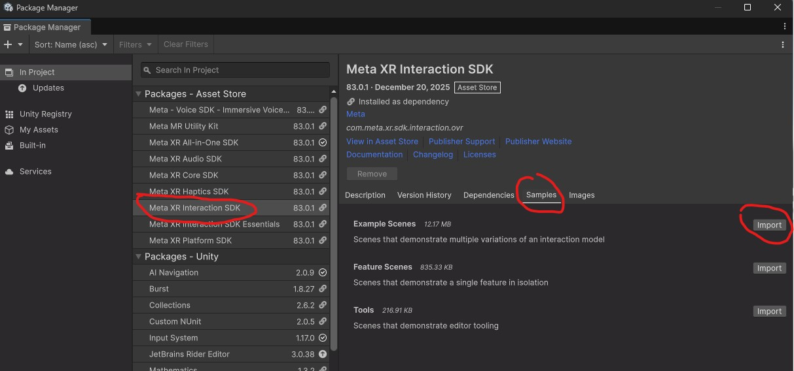
5. Wait for the scenes to import.
6. Close the package manager window. 
7. Back in the Unity Editor, the sample scenes should have been added to your project's Assets (Assets > Samples > Meta XR Interaction ​SDK > [Meta SDK Version] > Example Scenes).
8. Open the "PoseExamples" sample scene. 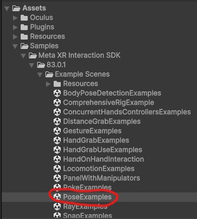
9. In the "PoseExamples" sample scene, copy the "Poses-Hands" game object. (You can use CTRL + C on the keyboard). 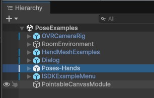
10. Go back to the scene where you want to add hand pose recognition. 
11. Paste the "Poses-Hands" game object to the scene. (You can use CTRL + V on the keyboard). 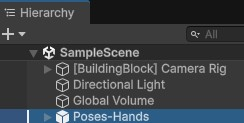
12. Some of the references in the "Poses-Hands" game object are no longer valid since we copied the object from another scene. Time to reconfigure them. Click on the "Poses-Hands" game object.
13. In the Inspector window, setup the "Hand Ref" scripts. They should be pointing to the "LeftInteraction" and "RightInteraction" game object representing the left and right hand tracking respectively. 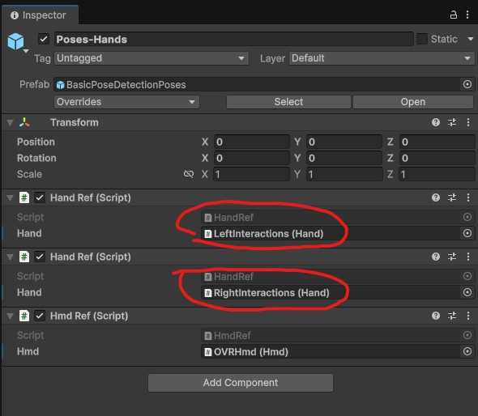
14. Expand the "Poses-Hands" game object and select "LeftHandRefs" 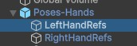
15. In the Inspector window, Set the "Finger Feature State Provider" and "Transform Feature STate Provider" properties. They should both be pointing to the left hand's features object (Located at: [BuildingBlock] Camera Rig > [BuildingBlock] OVRInteractionComprehensive > LeftInteractions > Features). 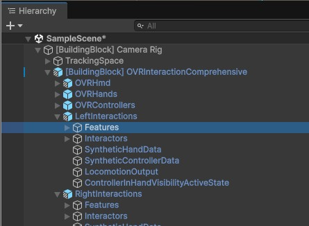 You can simply drag and drop the "Features" object to the properties: 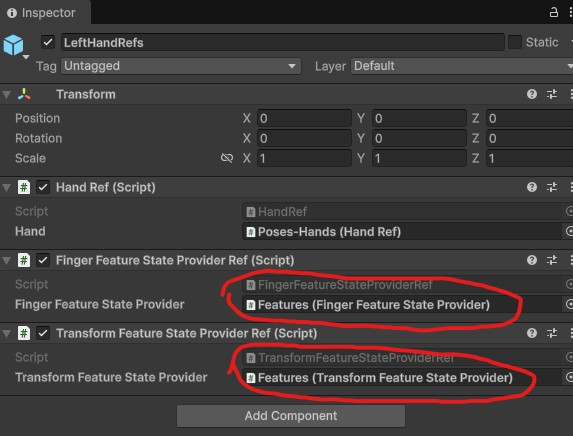
16. Do the same thing for the "RightHandRefs" game object by selecting the right hand's features object (Located at: [BuildingBlock] Camera Rig > [BuildingBlock] OVRInteractionComprehensive > RightInteractions > Features)
17. Cleanup the "Poses-Hands" game object. It includes many game objects and hand pose detections that you may not need. 
    - In my scene I want to recognize the thumbs up and thumbs down poses only: 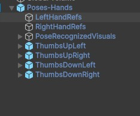
    - Under each of the poses you kept, there is an associated audio object. Delete them. 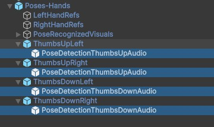
    - Delete the "PoseRecognizedVisuals" game object.
18. In each of the hand poses, there's an event handler. You can attach a function to be called when the pose is detected. In my case, I call a function that changes the 3D text to indicate which hand pose has been detected.
    - Click on the hand pose game object.
    - In the Inspector window, look for the "Selector Unity Event Wrapper (Script)" component. 
    - Add your custom game object and function that will handle the "When Selected()" event. 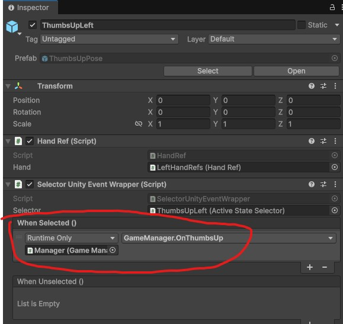
    - Repeat the previous step for your other poses. 
19. Now, play your scene and test that the pose has been recognized:
 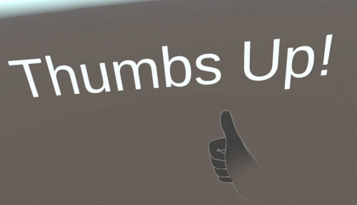
 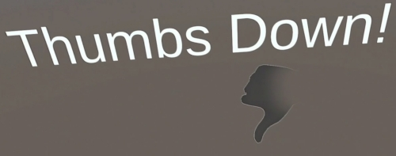
 Optional: You can delete the Interaction ​SDK sample scenes that were added to your project if you don't need them. (Asset > Samples folder).