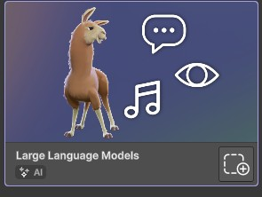
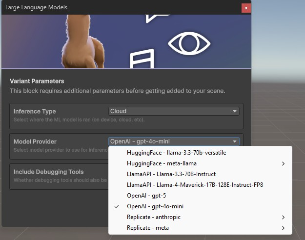
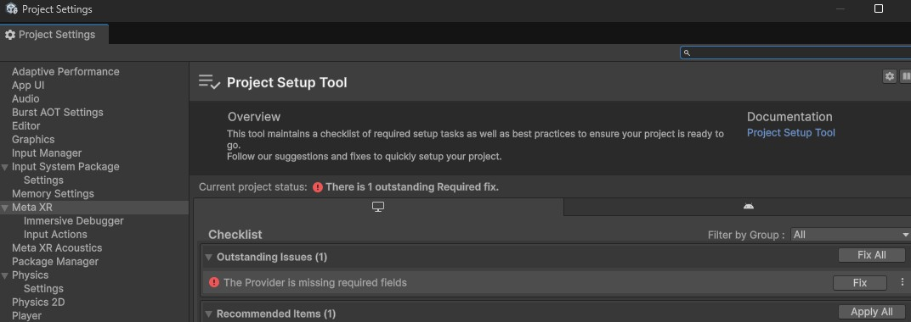
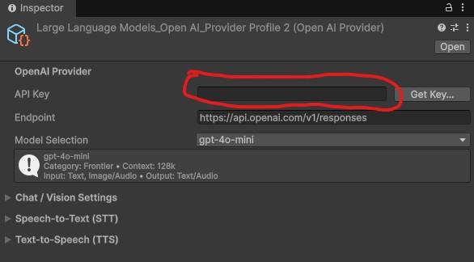
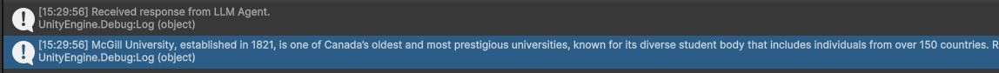
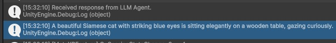

# LLM integration
> **⚠️ Warning:** This feature requires an API key for the specific model to use.
## Description
This tutorial will show you how to integrate generative AI in your project. 

## Example use cases
1. Generate unique NPC dialog.
2. On-the-fly scene description and storytelling.
3. Send an image to the LLM for a description of the content. 

## Tutorial - Simple text prompt
1. Add the "Large Language Model" building block to your scene.<br>
2. In the window that pops, select your desired LLM agent. Make sure you have an API key for that model.<br>
3. Click on the Confirm button.
4. A new game object "[BuildingBlock] Large Language Models" should be added to your scene.
5. Go to the project setup tool (Edit > Project Settings > Meta XR. You should see an error telling you that the LLM provider is missing fields.<br>
6. Click on Fix.
7. In the editor's inspector window, enter the API key to your LLM: <br>
8. Create a new empty object in your scene.
9. Add a new script PromptTest to that newly created game object.
10. Add the following content for your script.
 ```csharp
using UnityEngine;
using Meta.XR.BuildingBlocks.AIBlocks;
using System.Collections.Generic;

public class PromptTest : MonoBehaviour
{
    private LlmAgent _llmAgent;
    
    // Start is called once before the first execution of Update after the MonoBehaviour is created
    void Start()
    {
        _llmAgent = FindFirstObjectByType<LlmAgent>();
        _llmAgent.onResponseReceived.AddListener(ProcessResponse);
        
        _llmAgent.SendPromptAsync("You are a tourist guide who gives interesting facts in 1 or 2 sentences. Tell me an interesting fact about McGill University.");
    }

    public void ProcessResponse(string response)
    {
        Debug.Log("Received response from LLM Agent.");
        Debug.Log(response);
    }
}
```
11. Go back to the editor and wait for your script to compile.
12. Play your scene.
13. In the console, you should see the output of your prompt:<br>

## Tutorial - Prompt with an image
1. Follow the previous tutorial to get your scene set up.
2. Modify your script with the following:
 ```csharp
using UnityEngine;
using Meta.XR.BuildingBlocks.AIBlocks;
using System.Collections.Generic;

public class PromptTest : MonoBehaviour
{
    public Texture2D _inputImage;
    private LlmAgent _llmAgent;
    
    // Start is called once before the first execution of Update after the MonoBehaviour is created
    void Start()
    {
        _llmAgent = FindFirstObjectByType<LlmAgent>();
        _llmAgent.onResponseReceived.AddListener(ProcessResponse);
        
        string promptText = "Describe the following image in a sentence. Use 20 words or less.";
        var images = new List<ImageInput> { ChatImages.FromTexture(_inputImage) };
        _llmAgent.SendPromptWithImagesAsync(promptText, images);
    }

    public void ProcessResponse(string response)
    {
        Debug.Log("Received response from LLM Agent.");
        Debug.Log(response);
    }
}
```
3. Go back to the editor and wait for the script to compile.
4. Add the image you want to send to the LLM in your assets.
5. Drag and drop the image asset to the "Input Image" parameter of your script. 
6. Play the scene.
7. In the console, you should see the result of your prompt. In this example, I sent an image of a cat sitting on a table:<br>