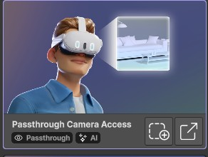
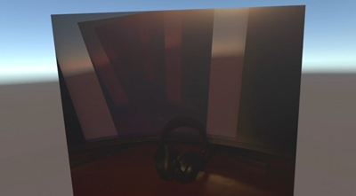

# Passthrough Camera Access (PSA)
> **⚠️ Warning:** This feature requires an Android build in Unity. 
## Description


## Example use cases
- Send the captured images to a server for processing (for example, send it to ChatGPT to describe the content of the image).
- Extract real-time lighting to be applied on your virtual objects. 
- A smart navigation system that alerts the user about real life obstacles in the way. 

## Tutorial
In this tutorial we will get the image of the Meta Quest 3 camera and display it on a 3D plane. We will do so by replacing the plane's texture by the image texture retrieved by the PassthroughCameraAccess API.

1. Add the "Passthrough Camera Access" building block to your scene:<br>
2. A new game object named "[BuildingBlock] Passthrough Camera Access" should be added to your scene.
3. In that game object, add a new scirpt "PassThroughTest" and add the following content.
```csharp
using UnityEngine;
using Meta.XR;

public class PassThroughTest : MonoBehaviour
{
    public GameObject _plane;
    private PassthroughCameraAccess _passthroughCameraAccess;

    void Start()
    {
        _passthroughCameraAccess = FindFirstObjectByType<PassthroughCameraAccess>();   
    }

    void Update()
    {
        // Check if the camera is playing
        if (_passthroughCameraAccess != null && _passthroughCameraAccess.IsPlaying)
        {
            // Get the texture (GPU access)
            var cameraTexture = _passthroughCameraAccess.GetTexture();
            
            // To get individual pixel colors (CPU access, can be intensive), uncomment the line below:
            // NativeArray<Color32> pixels = _passthroughCameraAccess.GetColors();

            // Apply the texture to the plane's material
            if (cameraTexture != null && _plane != null)
            {
                Renderer planeRenderer = _plane.GetComponent<Renderer>();
                if (planeRenderer != null)
                {
                    planeRenderer.material.mainTexture = cameraTexture;
                }
            }
        }
    }
}
```
4. In your scene add a new 3D plane that is facing the camera. 
5. Put the plane as the "Plane" parameter of the "PassThroughTest" script you created earlier. 
6. Now build and run the scene to deploy it on the headset. 
7. In the plane, you should see the headset camera's output. Here I was looking at my monitor with a headset on my desk: <br>
