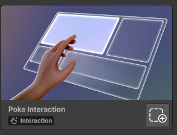
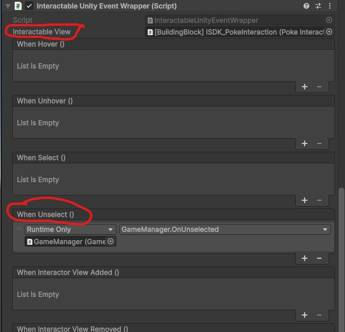

# Poke Interaction
## Description
Poke button is a type of button where the user has to "push" the button in the 3D space to activate an action. 

## Example use cases
- Present poke buttons to the user and select choices that affects the story line. 

## Tutorial
This tutorial will show you how to react to a poke button that has been "clicked". 

1. Add the "Poke Interaction" building blocks to your scene. 
2. A new game object "Poke Interaction" should be added to your scene.
3. Expand the "Poke Interaction" object.
4. Select the child object "[BuildingBlock] ISDK_PokeInteraction".
5. In the inspector window, add a new component "InteractableUnityEventWrapper"
6. Drag and drop the "Poke interactable" script (located in the same inspector window) to the "Interactable View" parameter.
7. In the "When Unselected" handler, add your target game object that contains the script to handle the event. In my case, I have a game object "GameManager" with a "GameManager" script that contains a "OnUnselected" function that logs when the poke event has been unselected. 
