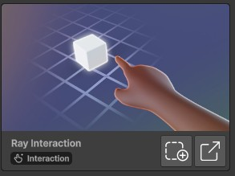

# Ray Interaction
## Description
Ray interaction lets user select something (for example a button) from a distance.

## Example use cases
- Present poke buttons to the user and select choices that affects the story line. 

## Tutorial
1. Add the "Ray Interaction" building blocks to your scene. 
2. Follow [Poke Interaction](poke_interaction.md) tutorial for the event handler (the process is similar).