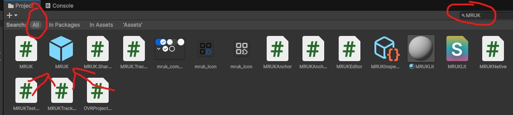
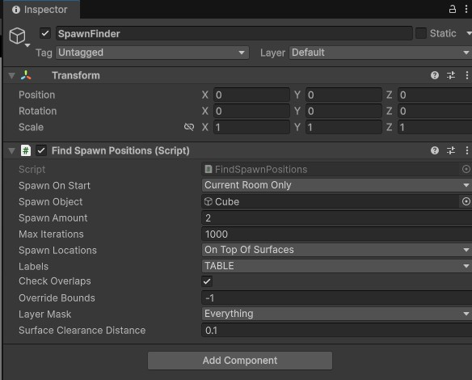
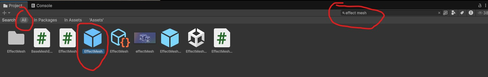
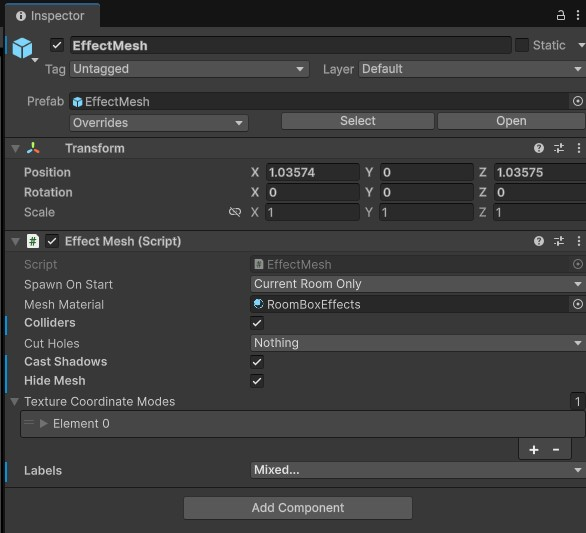
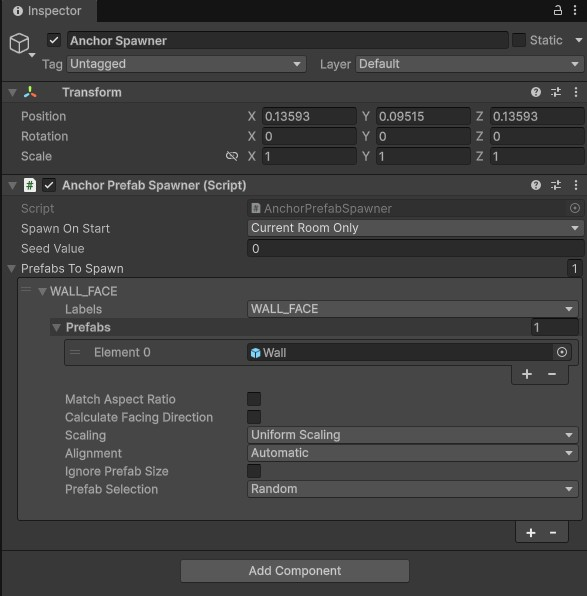

# Scene Understanding
> **⚠️ Warning:** This feature requires an Android build in Unity. 
## Description
Scene Understanding is a feature in Meta's mixed reality utility kit (MRUK) that helps your app recognize the real world around the user like walls, floors, tables, and other surfaces. On Meta Quest devices, these surfaces are labeled during the room setup process, when the user scans and defines their environment. Those labels are then stored and used by Scene Understanding so your app knows what each surface is.

This means you can easily place virtual objects where they make sense so your app feels more natural and interactive in the user’s actual surroundings.

**Important**: This feature requires the Android build if you want to use your actual environement. If using a Windows build, a random room will be generated instead. 

## Example use cases
- Place a furniture or decor in a realistic position. For example, a digital lamp on a table or a poster on a wall. 
- Create immersive mixed-reality experiences by reskinning walls and ceiling.

## Tutorial - Find spawn location
1. Search (use option all) & drop the MRUK prefab in your scene 

2. Add a new empty game object to the scene and name it "SpawnFinder"

3. In the "SpawnFinder" object, add the script "Find Spawn Positions" by Meta

4. Change the settings to your liking. The most importants settings are:
    1. Spawn object: the prefab you want to spawn
    2. Spawn amount: The amount of spawn object you want to have in your scene.
    3. Max iteration: the number of attempt the device should try before giving up a spawn. A value of 1000 is usually correct. 
    4. Spawn Location: Where on the label you want to spawn the object
    5. Labels: The label of the object you want to spawn your object on. The labels are assigned during the room setup on the Quest device. 
    

5. If you are spawning on top of a surface (example a table) and your spawn object uses gravity, add the EffectMesh prefab to the scene. This will prevent the object from going through the surface.  
    1. If the Effect Mesh settings, make sure "Colliders" is checked. If you want to have an outline of the detected labels (useful for debugging), you uncheck "Hide Mesh". 

## Tutorial - Reskinning furniture
1. Search (use option all) & drop the MRUK prefab in your scene 

2. Add a new empty game object to the scene and name it "Anchor Spawner"

3. In the "Anchor Spawner" object, add the script "Anchor Prefab Spawner" by Meta

4. In the "Anchor Prefab Spawner" script, edit the settings to your liking. THe important settings are:
    1. Labels: One or more label representing the object you want to reskin. The labels are assigned during the room setup on the Quest device.
    2. Prefabs: The prefab that you want to apply on the selected labels.  