# Teleportation
## Description
Teleporation lets the user move around in your virtual world.

## Example use cases
- Provide an alternative movement type from the "slide locomotion" which is known to give motion sickness.

## Tutorial: Teleportation.
The setup process for teleportation can be a bit tidious. Follow the tutorials in order:

### Tutorial 1: Setup
1. Add the "Interaction Rig" building block to your scene. 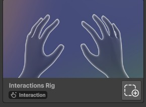
2. If you plan to use teleportation with controllers, add the "Controller Tracking" building block to your scene. 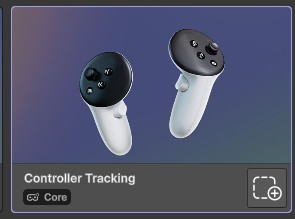
3. Choose the type of teleportation you want: either Tutorial 2 - Hotspot Teleportation or Tutorial 3 - NavMesh Teleportation.

### Tutorial 2 - Hotspot Teleportation
This type of teleportation allows you to teleport to specific location marked by a hotspot on the ground. Here is how to set it up:

1. Add the teleportation building block to your scene. 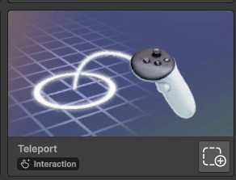
2. In the window that pops, choose "Hotspot" as the variant. 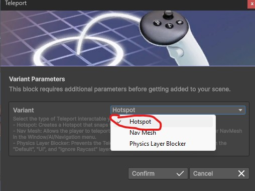
3. Click on confirm to add teleportation in your scene. A new game object named "Teleport Hotspot" should be in your scene.
4. Place the "Teleport Hotspot" game object in a teleportable location. For example, this can be in top of a plane surface. You can add as many hotspots as you want. 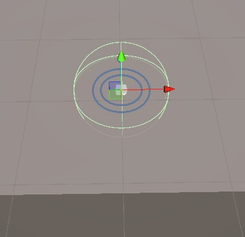
5. Follow Tutorial 4 or Tutorial 5 whether you want to implement teleportation for hand tracking or controllers. 

### Tutorial 3 - NavMesh Teleportation
This type of teleportation allows you to teleport freely anywhere on a baked nav mesh. Here is how to set it up:

1. Add the teleportation building block to your scene. 
2. In the window that pops, choose "Nav Mesh" as the variant. 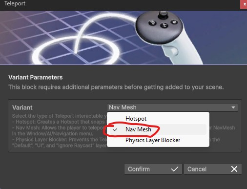
3. Click on confirm to add teleportation in your scene. A new game object named "Teleport NavMesh" should be in your scene.
4. Choose the target object you want to teleport on. This can be most flat 3D object although a plane 3D object will work best.
5. In the inspector of the target object, add a new "NavMesh Surface" component.
6. In the NavMesh Surface component click on the "Bake" button create the nav mesh. 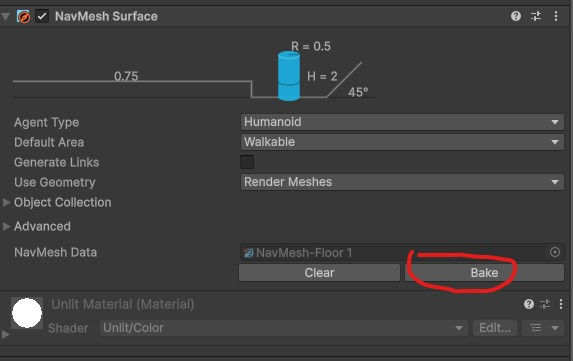
8. You should see your teleportable area in blue. Notice how it avoids obstacles as teleportable area. 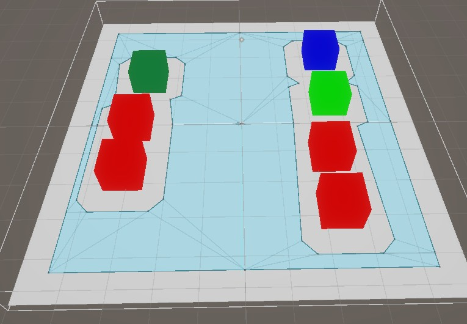
9. Follow Tutorial 4 or Tutorial 5 whether you want to implement teleportation for hand tracking or controllers. 

### Tutorial 4 - Teleportation with hand tracking
1. To enable teleportation with hand tracking, place your hand in a "thumbs up" position.
2. Tap your thumb against your index finder. The teleporting arc should appear: 
3. If the teleportation spot is valid (for example on a hotspot), the teleportation arc will change color: 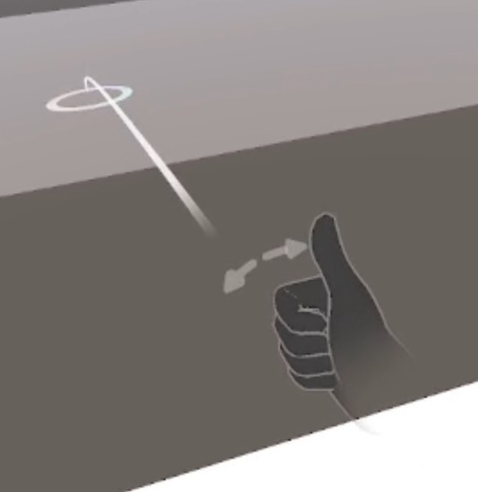
4. Tap your thumb against your index finger again to teleport!
5. To turn around, slide your thumb left or right on your index finger to turn left or right.

### Tutorial 5 - Teleportation with controllers
1. By default, the "slide locomotion" is enabled in the interaction rig when using controllers. We need to disable it first.
2. In your scene hierarchy, serach for "ControllerSlideInteractor".
3. Select the ControllerSlideInteractor object under the left interactor. It should be enabled by default. 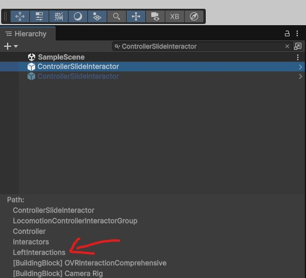
4. In the inspector, disable the ControllerSlideInteractor object. 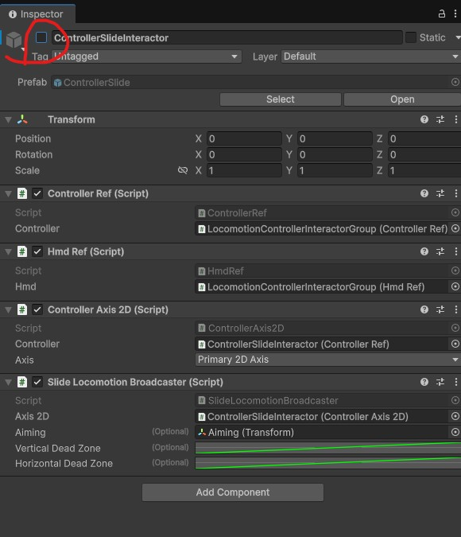
5. In your scene hierarchy, serach for "TeleportControllerInteractor".
6. Select the TeleportControllerInteractor object under the left interactor. 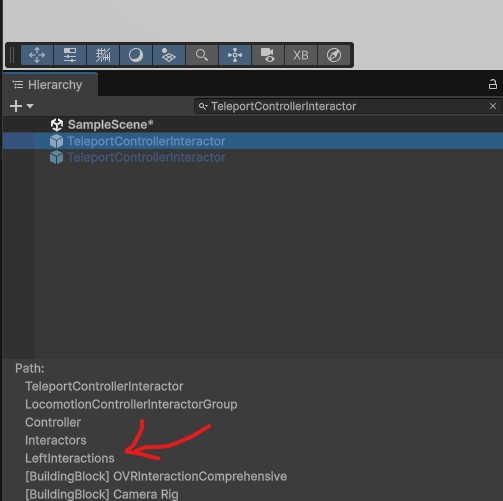
7. In the inspector, enable the TeleportControllerInteractor object.
8. Now you can play your scene.
9. When moving the left thumbstick forward, the teleport arc should appear: 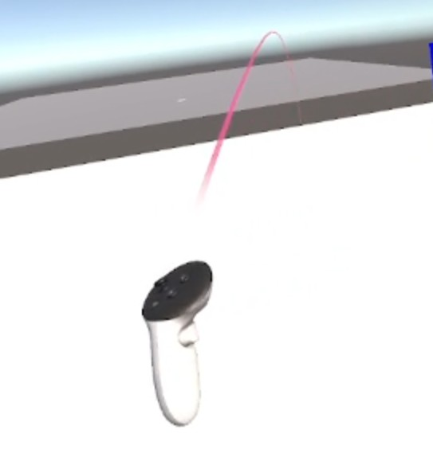
10. If the teleportation spot is valid (for example on a hotspot), the teleportation arc will change color: 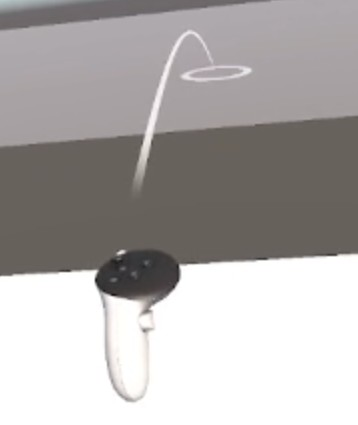
11. Release the left thumbstick to teleport!
12. Optionally, you can follow tutorial 6 to reduce motion sickness further.

### Tutorial 6 - Snap turn angles (Controllers only)
1. In your scene hierarchy, serach for "ControllerTurnerInteractor".
2. Select the ControllerTurnerInteractor object under the right interactor. It should be enabled by default. 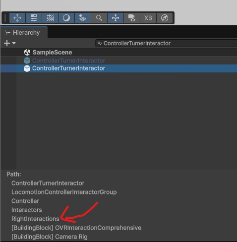
3. In the inspector, go to the "Turn Event Broadcaster" script and change the "Turn Method" to "Snap". 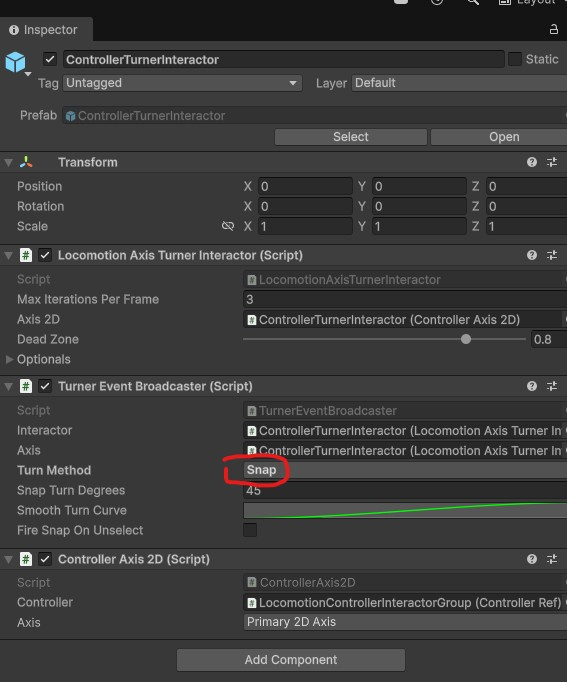
4. This should snap the turn when you use the right thumbstick.
